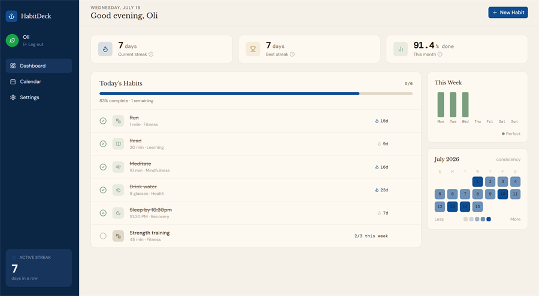
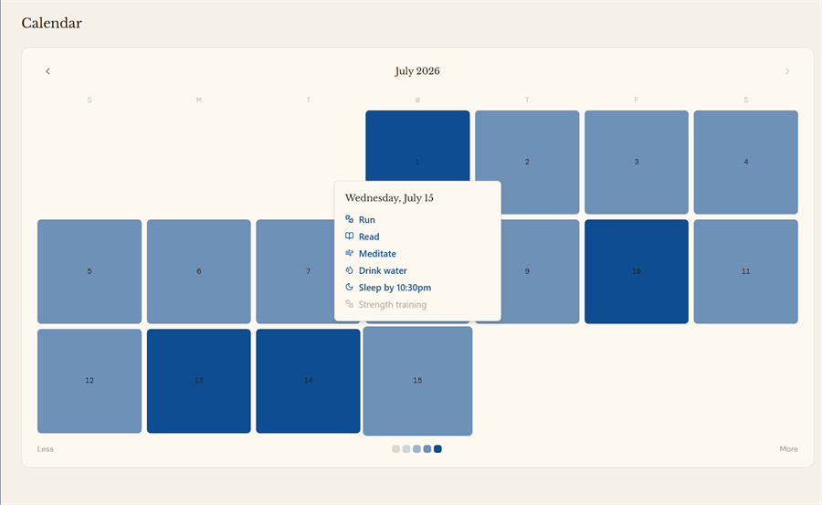
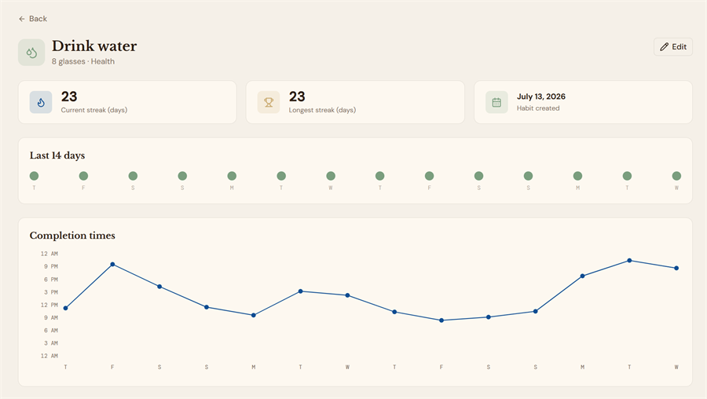

# HabitDeck

A simple web app for tracking daily habits: create habits, mark them
done each day, and watch your streaks build over time. Built solo as an
end-to-end practice project: frontend, backend, database, and deployment, kept
deliberately simple rather than feature-heavy.

## Live Demo
- App: https://habit-deck.vercel.app/
- API: https://habit-deck.vercel.app/api/health

## Screenshots
| Dashboard | Calendar | Habit Detail |
| --- | --- | --- |
|  |  |  |

## Features
- Accounts via Supabase Auth (email/password), with a first-login onboarding
  step (display name + avatar icon) and self-service account deletion
- Every habit scoped to its owner; create, rename, and archive habits, daily
  or N-times-a-week cadence
- Mark a habit done for today, toggleable (click again to unmark)
- Current streak and longest streak per habit, computed server-side
- Dashboard with weekly completion chart, month calendar widget, and
  aggregate stats (active streak, best streak, month completion %)
- Calendar page with a full month view — hover any day to see which habits
  were completed and which weren't
- Habit Detail page per habit: 14-day dot strip, 30-day calendar, and a
  completion-time line chart, each with hover detail
- Settings page: display name, avatar icon, password change, theme, delete
  account
- Toast notifications, loading skeletons, and a 404 page
- Light/dark theme toggle

## Tech Stack
- Frontend: Vite, React, TypeScript, Tailwind CSS, a small Radix/shadcn
  component subset, lucide-react icons, Recharts, react-router-dom,
  @supabase/supabase-js
- Backend: Python, FastAPI, deployed as a Vercel serverless function
- Auth: Supabase Auth — JWT verified locally against Supabase's JWKS endpoint
  for regular requests; the Admin REST API (service role key, backend-only)
  backs self-service account deletion
- Database: Postgres via Supabase, accessed with SQLAlchemy 2.0
- Deployment: [Vercel](https://habit-deck.vercel.app/) — frontend
  (static build) and backend (FastAPI as a Python serverless function) as one
  project.

## How to Run Locally
```
python -m venv .venv
.venv\Scripts\Activate.ps1   # Windows PowerShell
pip install -r requirements.txt
copy .env.example .env       # fill in DATABASE_URL, SUPABASE_URL, SUPABASE_SERVICE_ROLE_KEY, VITE_SUPABASE_URL, VITE_SUPABASE_ANON_KEY
uvicorn backend.main:app --port 8000 --reload
```
In a second terminal:
```
npm install
npm run dev
```
The frontend runs at http://localhost:5173 and proxies `/api` requests to
the backend on port 8000 (see `vite.config.ts`).

## License
MIT — see [LICENSE](LICENSE).
